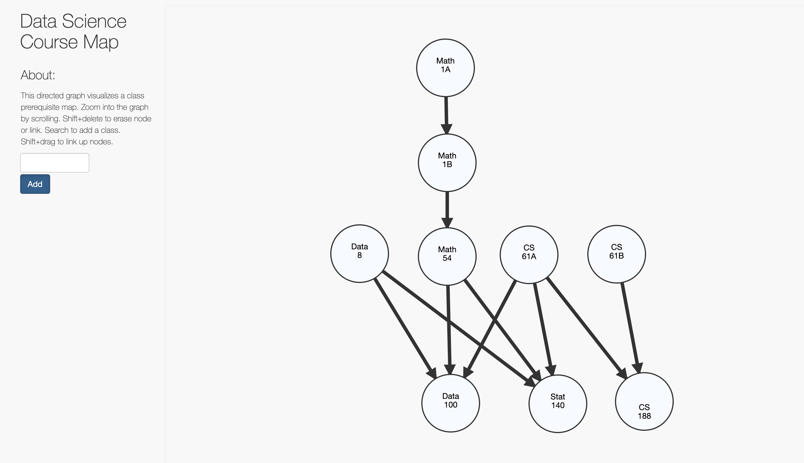

# bearmap
### Work In Progress

Berkeley has a wide variety of classes to offer but students can often find themselves lost when planning their schedule. This website offers an alternative way to build a course plan. It is visually simple and offers enough functionality to any individual to pick classes that suit them best.

## Technology Used
### Database of Classes
All the classes have been webscraped into a MongoDB database from the official class website http://guide.berkeley.edu/undergraduate/departments/

### Backend and Frontend
The backend is coded in Python with the Flask framework. Data is retrieved from the database and is sent to the front end for the graph initialization.

The frontend uses mainly D3.js to make the website interactive. I did not write the whole frontend code from scratch but modified code that I found from https://bl.ocks.org/cjrd/6863459
